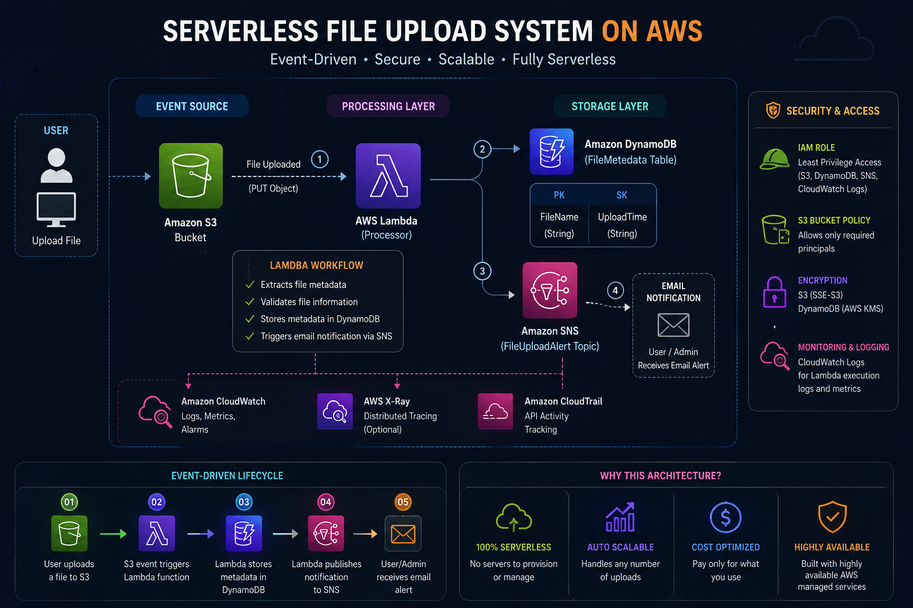
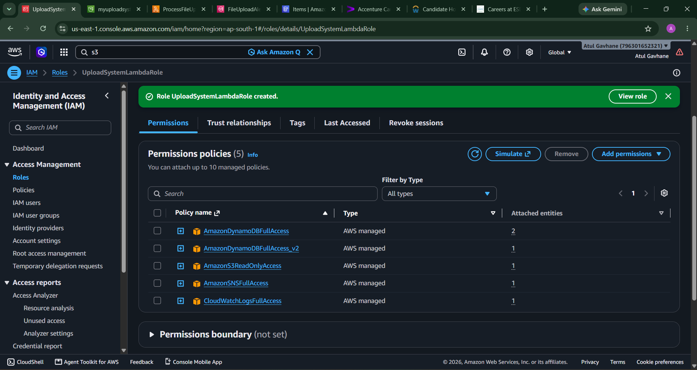
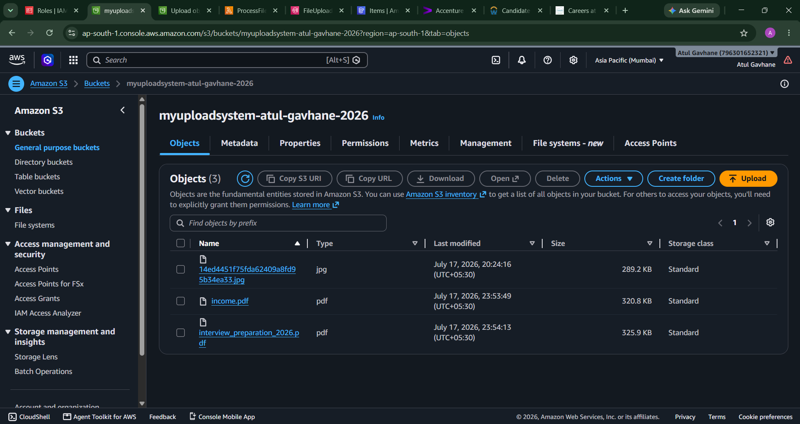
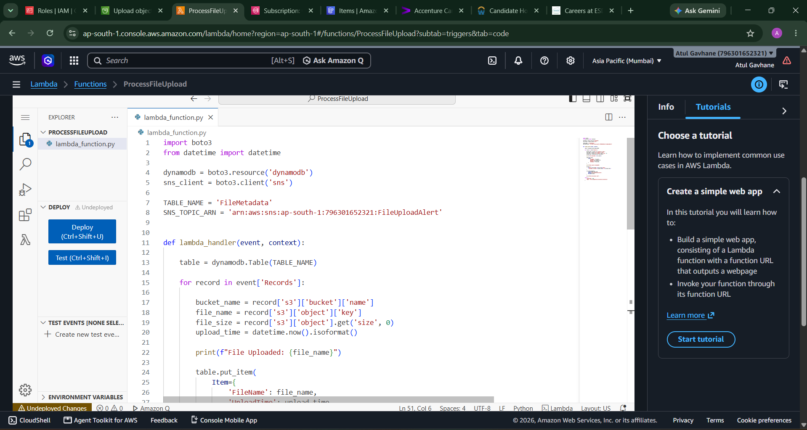
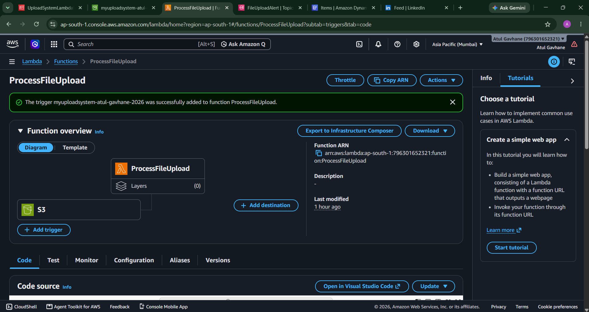
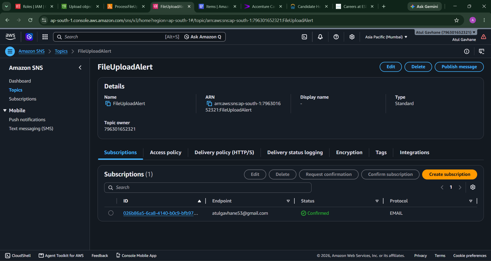
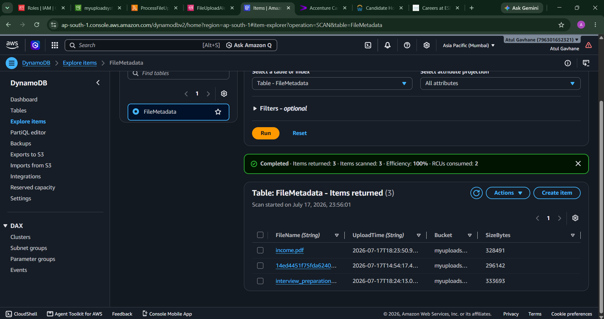
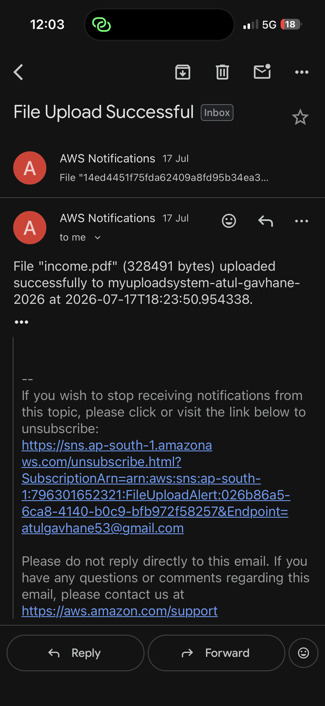

# AWS Serverless File Upload System

## Overview
An event-driven, fully serverless file processing pipeline built on AWS. 
When a file is uploaded to S3, it automatically triggers metadata storage 
in DynamoDB and sends an email notification via SNS — no servers to manage.

This was my first project where I tried to build something serverless. 
I learned how S3 events trigger Lambda and how to store data in DynamoDB.

## Architecture
S3 (Upload) → Lambda (Process) → DynamoDB (Store Metadata) + SNS (Notify)

## Tech Stack
- AWS S3 (Object Storage)
- AWS Lambda (Python 3.13)
- AWS DynamoDB (NoSQL Database)
- AWS SNS (Notifications)
- IAM (Least-privilege security)

## Features
- Fully serverless — zero server management
- Auto-scales with traffic
- Real-time email alerts on file upload
- Metadata tracking (file name, size, timestamp)

## How It Works
1. User uploads a file to the S3 bucket
2. S3 event triggers the Lambda function automatically
3. Lambda extracts file metadata and writes it to DynamoDB
4. Lambda publishes a notification via SNS
5. Subscriber receives an email confirmation

## Screenshots

### Architecture

### IAM Policies

### S3 Bucket

### Lambda Function

### SNS Topic

### DynamoDB Output

### SNS Email Alert

## Cost
Built entirely within AWS Free Tier — $0 cost.

## Future Improvements
- Add file type validation
- Add Dead Letter Queue for failed events
- CloudWatch alarms for monitoring
